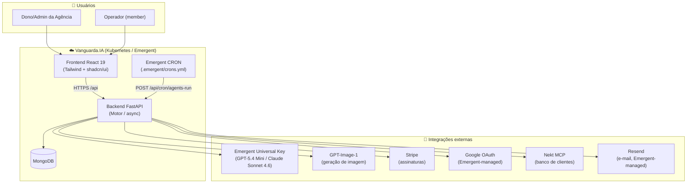
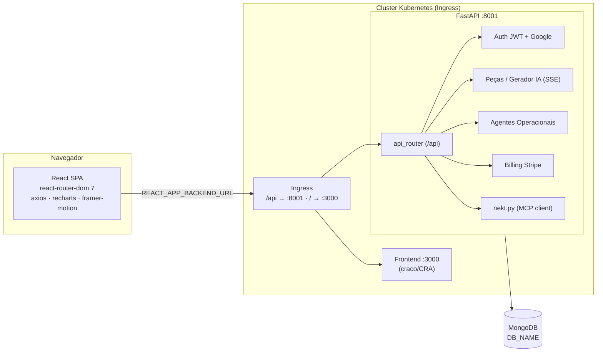
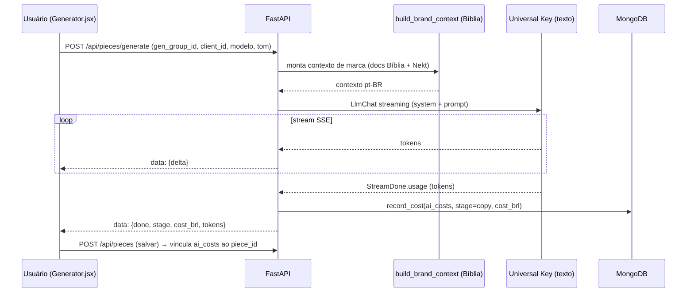
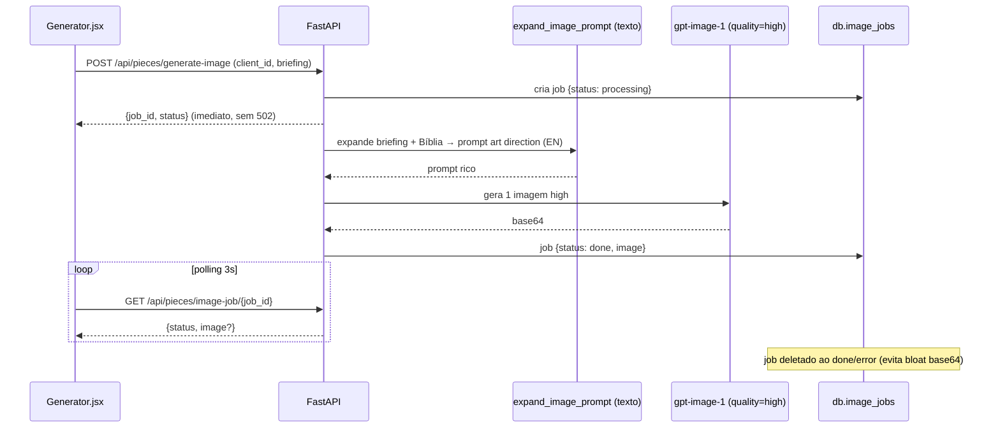
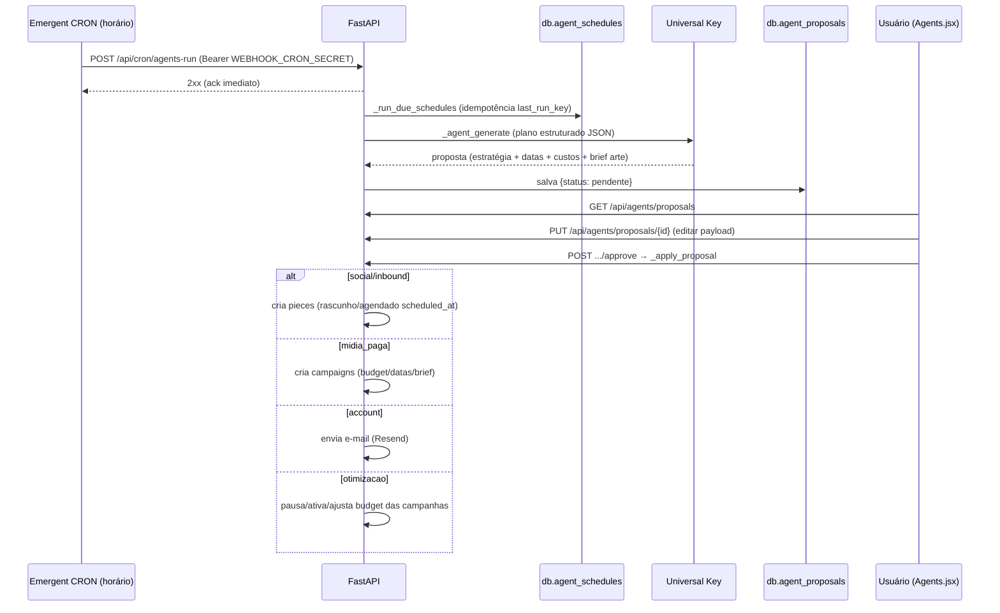
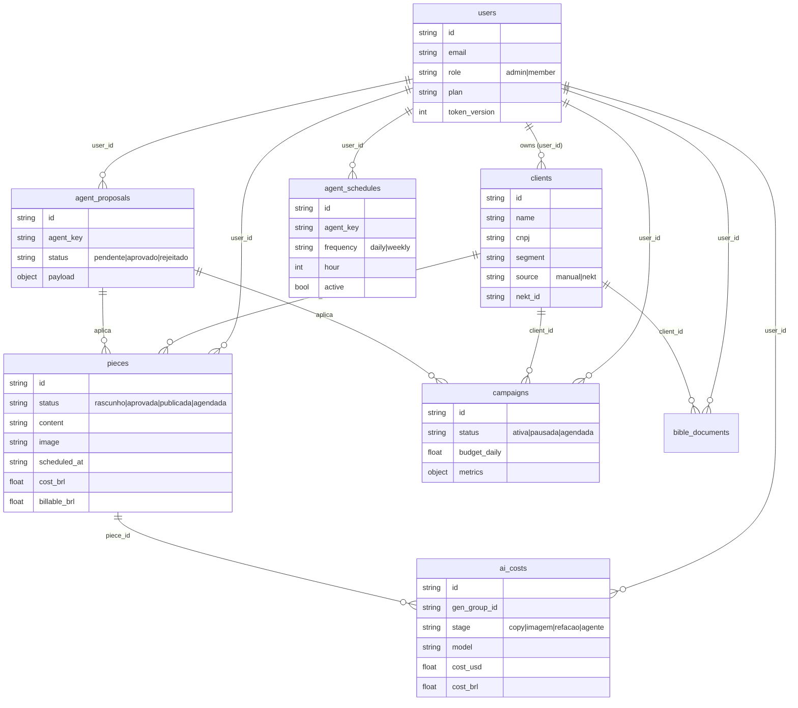

# Vanguarda.IA — Desenho da Arquitetura

> Plataforma SaaS B2B de IA para agências de marketing. Multi-tenant, geração de peças/imagens com IA contextualizada por marca ("Bíblia"/RAG), dashboard de Meta Ads, agentes operacionais autônomos (human-in-the-loop), custeio de IA por peça e assinaturas Stripe.

---

## 1. Visão geral (C4 — Contexto)

---

## 2. Containers (C4 — Containers)

---

## 3. Fluxo — Geração de peça com IA (SSE + custeio)

---

## 4. Fluxo — Geração de imagem assíncrona (fim do 502)

---

## 5. Fluxo — Agentes Operacionais (human-in-the-loop + CRON)

---

## 6. Modelo de dados (MongoDB)

Demais coleções: `activity_logs`, `alert_rules`, `alert_occurrences`, `app_settings`, `image_jobs`, `login_attempts`, `password_reset_requests`, `password_reset_tokens`, `user_sessions`.

---

## 7. Decisões de arquitetura (ADR resumido)

| # | Decisão | Motivo |
|---|---------|--------|
| 1 | **Universal Key (Emergent)** para LLM em vez de SDKs diretas | Troca de modelo (GPT/Claude) sem gerenciar múltiplas chaves |
| 2 | **Geração de imagem assíncrona** com polling | Evita timeout 502 do proxy de ingress (~55s/imagem) |
| 3 | **Human-in-the-loop** nos agentes (proposta → aprovação → ação) | Controle da agência antes de publicar/pausar/gastar |
| 4 | **CRON da plataforma** (`.emergent/crons.yml`) | Agendamento gerenciado; endpoint só faz ack + background |
| 5 | **Multi-tenant por `user_id`** (sem tabela de tenant) | Simplicidade; todas as queries filtram por `user_id` |
| 6 | **Custeio de IA por etapa** com markup configurável | Agência fatura o cliente com margem sobre o custo real |
| 7 | **Nekt via MCP (JSON-RPC)** read-only | Sincroniza ~133 clientes sem acesso direto ao banco deles |

---

## 8. Observações / dívida técnica

- `backend/server.py` está com ~2160 linhas — recomendado quebrar em `routers/` (auth, pieces, agents, billing, integrations).
- Meta Ads é **mock** (dashboard e ações de otimização atualizam só o estado no DB, não a Graph API real).
- Imagens são armazenadas como **base64** no documento — backlog: mover para object storage (URL).
- RAG da Bíblia usa **sobreposição de palavras**, não embeddings vetoriais.
